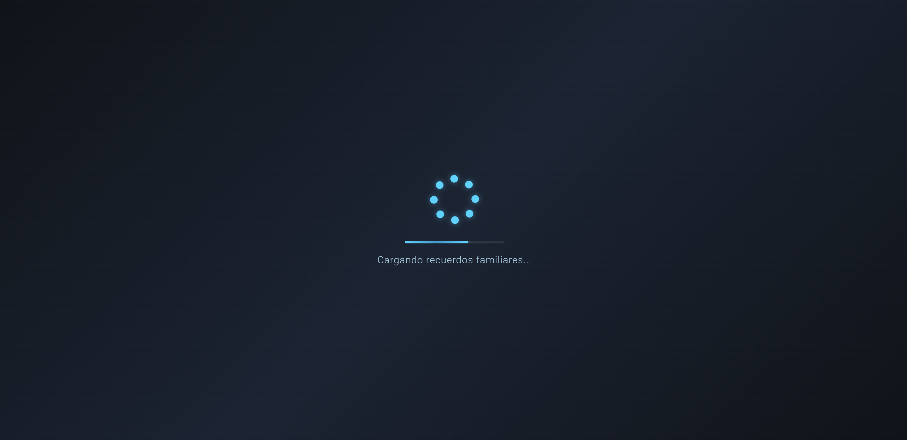

# MemoriesVault

Una aplicación para organizar tus fotos y videos personales, marcar favoritos y crear colecciones. Todo privado y fácil de usar.

## Development server

To start a local development server, run:

```bash
ng serve
```
```bash
npm start
```

Once the server is running, open your browser and navigate to `http://localhost:4200/`. The application will automatically reload whenever you modify any of the source files.

## Vista de la galería



## Selección de favoritos


## Instalación y configuración

1. **Instala las dependencias**  
Ejecuta en la raíz del proyecto:

```bash
npm install
```

2. **Organiza tus archivos**  
En la carpeta `src/assets/Albumes/` crea una estructura como esta:
src/assets/Albumes/
├── 2024/
│ ├── CRUCERO_2024/
│ │ ├── playa.jpg
│ │ ├── barco.mp4
│ │ └── ...
│ └── CUMPLEAÑOS/
│ ├── tarta.jpg
│ └── ...
└── 2023/
└── VACACIONES/
└── ...

- Cada año es una carpeta.
- Dentro de cada año, crea carpetas para tus colecciones.
- Añade dentro tus fotos y videos.
- Borre las carpetas de años que no necesites (ya que son de prueba)

3. **Genera el archivo JSON de contenido**  
Ejecuta:

```bash
npm run generate-json
```

> **Importante:**  
Cada vez que añadas, elimines o cambies fotos, videos o colecciones, vuelve a ejecutar este comando para actualizar la galería.

## Uso de la galería

1. **Inicia la aplicación**  

```bash
npm start
```

2. **¿Qué puedes hacer?**
- Ver tus fotos y videos organizados por años y colecciones.
- Marcar tus favoritos.
- Descargar imágenes y videos.
- Navegar y hacer zoom fácilmente.
- Poner musica mientras ves tus fotos y videos.
- Muchas opciones de visualizacion.

## Estructura del JSON generado

El archivo `src/assets/albums.json` tendrá un formato como este:
{
"2024": {
"CRUCERO_2024": [
{ "name": "playa.jpg", "type": "image", "path": "assets/Albumes/2024/CRUCERO_2024/playa.jpg" },
{ "name": "barco.mp4", "type": "video", "path": "assets/Albumes/2024/CRUCERO_2024/barco.mp4" }
],
"CUMPLEAÑOS": [
{ "name": "tarta.jpg", "type": "image", "path": "assets/Albumes/2024/CUMPLEAÑOS/tarta.jpg" }
]
},
"2023": {
"VACACIONES": [
...
]
}
}

## Consejos importantes

- Usa nombres de carpetas sin espacios y sin caracteres especiales (mejor `CRUCERO_2024`).
- Los tipos de archivo soportados son:  
  Imágenes: `.jpg`, `.png`, `.webp`, `.jpeg`, `.svg`, `.gif`,     
  Videos: `.mp4`, `.webm`, `.mov`, `.avi`, `.mkv`,
- Recuerda ejecutar `npm run generate-json` cada vez que cambies algo en tus álbumes.

---

¡Disfruta organizando y reviviendo tus recuerdos con MemoriesVault 🎉

## Additional Resources

For more information on using the Angular CLI, including detailed command references, visit the [Angular CLI Overview and Command Reference](https://angular.dev/tools/cli) page.
